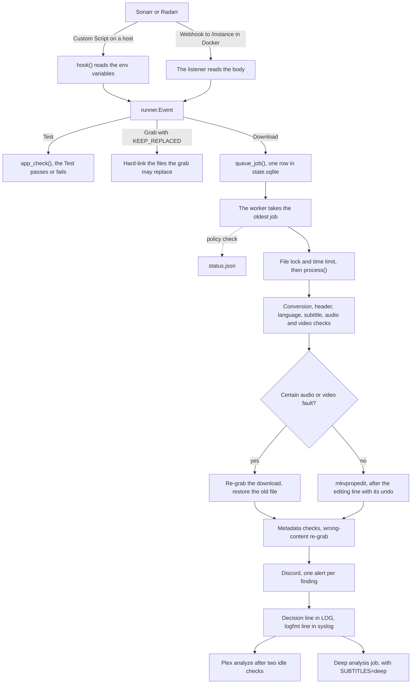

# How it works

This page follows one imported file from Sonarr or Radarr to the alert and the Plex analyze. It is for someone new to
the project. Each section says what happens and why, and links to the detail in [design.md](design.md) or another doc.
These terms come up often.

- A *job* is one imported file that waits in the queue.
- The *worker* is the process that takes the jobs and checks the files.
- The *decision line* is the JSON line in the decision log for one file.
- A *certain fault* proves that a file is broken and leads to a re-grab. A *doubt* only alerts.

## The import path

## 1. An event arrives

Sonarr and Radarr send an event at each import, upgrade, Grab and Test. On a host, each app runs the script as a
**Custom Script** connection, and `hook()` in `runner.py` reads the event from environment variables. In Docker, each
app posts a **Webhook** to the listener in `serve.py`, at `/<instance name>`. Both build the same `runner.Event`, so
the rest of the path is one code path.

- **Download** is an import or an upgrade. It becomes a job.
- **Grab** comes when the app picks a release. With `KEEP_REPLACED=true`, the hook hard-links each file the grab may
  replace, so a bad upgrade can be undone later. See [regrabs.md](regrabs.md#keep-replaced-files).
- **Test** runs the setup checks, see [The Test event and the start check](#the-test-event-and-the-start-check).
- Any other event gets an answer and changes nothing.

The listener checks the user and password, the body size and each id. It asks the app's API for the file path by the
file id, and never uses the path in the body. See [design.md](design.md#webhook).

## 2. The job is queued

`queue_job()` writes the job as one row in the queue of the state store. The hook then prints `queued <path>`, starts a
worker if none runs, and exits 0. The listener answers 200. The app waits for this answer. So when the store stays busy
for 2 seconds, the job goes into `STATE_DIR/queue/` as a file. The worker moves it into the store later.

In Docker, the listener queues an import even when the app's API fails. The worker asks the app again, after a minute
at first and at most an hour apart, for a day. See [design.md](design.md#webhook).

## 3. The worker takes the jobs

`worker.lock` keeps one worker. On a host the hook forks it, so it runs in the app's cgroup, see
[design.md](design.md#memory). In Docker the listener starts `arr-media-guard --serve --worker` after each job, and
every 60 seconds while a job waits.

At its start the worker removes the work folders a killed step left. It prunes the kept files once a day. It puts back
the jobs a dead worker left, and takes the Plex analyzes a stopped worker kept. It then runs the import jobs, oldest
first, and exits when the queue is empty and no Plex analyze waits. With `HOOK_WORKERS` above 1, it forks one process
per job. A job process that crashes three times drops its job. See [design.md](design.md#how-it-runs).

Before the checks, the worker skips a job whose file a re-grab of its download deleted. It drops a job whose file is
gone and a job older than a day. When the app renamed the file, the worker asks the app for the new path by the file
id. A policy file that does not load skips the job, and one alert names the error.

## 4. The checks

`process()` in `process.py` runs the steps of one file in this order. A step that ends the run stops it there.

| Step | What it does | Detail |
| --- | --- | --- |
| Conversion | A file that is not Matroska becomes `<base>.mkv` with `CONVERT=true`. A `.mkv` file that holds another container always converts. | [design.md](design.md#conversion) |
| Header | Reads the Matroska header and Cues. A wrong header gets a lossless remux, after a video check finds no damage. | [design.md](design.md#header-repair) |
| Language | Classifies every track and plans the flags. An optional Whisper model hears an audio track whose language is in doubt. A word count reads the language of subtitle text. | [design.md](design.md#language-tags) |
| Subtitles | Hears two windows of the audio and compares the words with each text subtitle in the audio's language. It also checks the timing and the cues that flash. `SUBTITLES` sets what it does. | [subtitles.md](subtitles.md) |
| Audio and video | Samples the audio track that will play, then reads the video. A hook job runs them, and a scan runs them over the library. | [design.md](design.md#broken-audio) |
| Content | Checks the language, runtime, year and episode title against the app and TMDB. | [design.md](design.md#metadata-checks) |

The content checks run after the edit, with a time limit of their own. A failure or a timeout there costs only those
checks, and the edit is already done.

## 5. The decision

The rules in `decide.py` read the policy file. They give each audio and subtitle track a language, a confidence and a
role. Then they pick the audio that plays first, and the subtitles to match. When the signals conflict, the plan stays
empty, and the outcome is `undecided`. A plan that would break an invariant, such as a file with two default audio
tracks, is dropped. See [design.md](design.md#what-it-changes) and [policy.md](policy.md).

## 6. The actions

A certain audio or video fault replaces the flag edit with a re-grab. Else the planned edits run.

- **Flag edit.** `mkvpropedit` sets the default and forced flags and the language tags in place. An `editing` line with
  the full undo command goes to the decision log first. A second probe then checks every flag. A hardlinked file is
  never edited, because the edit would also change the download client's copy. See
  [monitoring.md](monitoring.md#undo-an-edit).
- **Header repair.** mkvmerge writes the file again with no new encode. The new file must pass a proof before it takes
  the old name, and the original stays in `.<NAME>-originals`. See [design.md](design.md#header-repair).
- **Subtitle remux.** One remux removes a subtitle of another episode, retimes a late one and lengthens the cues that
  flash. It keeps the original too. When the remux cannot run, a wrong track loses its flags instead. See
  [design.md](design.md#subtitle-match).
- **Conversion.** A packet proof compares every stream of the new file with the original. The app then lists the new
  file, and only then the original goes. A conversion that shows a damaged source re-grabs. See
  [design.md](design.md#conversion).
- **Re-grab.** A second check from scratch must find the same certain fault. The worker then deletes the broken files
  of the whole download through the app. It monitors the items again and marks the grab failed, so the app searches
  again. The old file of a broken upgrade comes back from the recycle bin, or from the hook's own copy, before the app
  searches. `REGRAB_CAP` limits the re-grabs of each instance in 24 hours. See [regrabs.md](regrabs.md).
- **Wrong content.** The content checks add up points, and two points make a re-grab. It runs only when `REGRAB` lists
  `content`. Else the alert says "would re-grab". See [design.md](design.md#metadata-checks).
- **Sidecars.** An `.srt` file beside the video that holds another episode moves to the kept originals. One that runs
  late is written again with new times. See [subtitles.md](subtitles.md).
- **Kept files.** A repair keeps the file it replaced for `KEEP_ORIGINALS_DAYS`, as a hard link in `.<NAME>-originals`
  on the file's mount. The prune removes it later, see [The nightly job](#the-nightly-job) and
  [regrabs.md](regrabs.md#kept-originals).

After a remux or a conversion, the worker asks the app to rescan the item.

## 7. The outputs

The alerts go out at the end of `process()`. The worker then writes the decision line, and the Plex analyze waits in
the worker until Plex is ready.

- **Decision log.** One JSON line per file in `LOG`, with the tracks, the plan, the reason codes, the outcome and each
  finding. The code never reads the log back. The state store keeps the facts the audit needs. See
  [monitoring.md](monitoring.md#the-decision-log).
- **Syslog.** One logfmt summary of the same line, tagged with `NAME`. In Docker it also goes to the container log. See
  [monitoring.md](monitoring.md#syslog).
- **Discord.** One embed per finding to `DISCORD_WEBHOOK`. A marker in the state store stops a repeat for the same
  file, kind and size. See [design.md](design.md#alerts).
- **Plex.** After a change, the worker asks Plex to analyze the one item, so Plex reads the new flags. A new import is
  often not in Plex yet, so the worker looks for it again for 10 minutes. Before each analyze, the item's library
  section must be idle on two checks 15 seconds apart. An analyze during a scan can crash Plex. A renamed file gets a
  scan of its folder instead. With `PLEX_URL` empty, nothing goes to Plex. See [design.md](design.md#plex).
- **status.json.** The state of the policy file and the TMDB key, for a monitoring agent. Each job records the policy,
  and each live TMDB answer records the key. See [design.md](design.md#status-file).

With `SUBTITLES=deep`, an import of a file with subtitles also queues a deep analysis of it. The worker runs it
only while no import waits, and it stops between two steps when an import arrives. See
[design.md](design.md#how-it-runs).

## The Test event and the start check

Press Test in the app's connection, or Save it, and the app sends a Test event. `runner.app_check()` then checks that
the policy loaded and that the app's API answers with its key. It also checks that this script sees each root folder of
the app. On a host it checks the Instance Name too, see [Named instances](#named-instances). A failed check fails the
Test and names what to fix. On a host the script answers `arr-media-guard: Test ok` or exits 1. The listener answers 200
or 500. A recycle bin that is off or out of reach only warns. Without one, the restore after a bad upgrade needs
`KEEP_REPLACED`.

In Docker, the listener prints a banner and listens. In a thread it checks the path maps, then runs the Test checks for
each app with an API key. It asks an app that does not answer again for 2 minutes. A failed check prints a warning,
and the listener keeps running. See [docker.md](docker.md#the-listener).

`--selftest` fails on a setting it cannot read or a policy file that does not load. It only warns about the apps.

## The nightly job

The nightly job audits the day's edits, prunes the kept files and rotates the decision log.

| Job | What it does | On a host | In Docker |
| --- | --- | --- | --- |
| Audit | `--audit <instance> --since 24h --post` reviews the day's edits from the state store, and probes an edit logged without its recheck. It posts one summary when the day had something to report. It writes one syslog line every night, and it records the policy status. | A systemd timer or cron, one line per instance. | The listener at `AUDIT_TIME`, for each instance whose API key reads. |
| Prune | Removes the kept originals and the grab links older than `KEEP_ORIGINALS_DAYS`. | The audit, and the worker once a day. | The same. |
| Log rotation | Rotates the decision log weekly, with compression. | logrotate. | The listener, after the audits. |

In Docker the listener starts `arr-media-guard --serve --daily` once a day, which runs the audits and then logrotate.
When the container was down at `AUDIT_TIME`, they run when it starts again that day. An empty `AUDIT_TIME` turns both
off. The worker's own prune covers a host with no nightly audit. A `status.json` whose `last_hook_run` is older than 2
days shows that the audit or the script stopped. See [commands.md](commands.md#the-audit),
[design.md](design.md#audit) and [monitoring.md](monitoring.md#rotate-the-decision-log).

## Backfill and scans

The hook sees only new imports. Commands run the same code over the library, dry unless `--apply` is given.

- `--backfill <instance>` runs the decision over the files the app lists, and with `--apply` it edits the flags. It
  runs at nice 19 and idle I/O priority. It never posts to Discord and never re-grabs.
- `--backfill <instance> --convert` adds the conversion, and `--sub-check` adds the subtitle check. `--sub-time PATH`
  runs the full subtitle check on single files.
- `--check-audio` and `--check-video` scan every file the way the worker checks an import. A scan only reads. It
  keeps its place in the state store, so it resumes over days. It lists what it finds in
  `STATE_DIR/<kind>-scan-<instance>.txt`, or `<kind>-scan-<instance>-ids.txt` for a run with `--ids`, and posts one
  summary.

Run a large backfill as a dry run, an audit of the plans, a canary and then the rest. See
[commands.md](commands.md#dry-runs-and-the-backfill) and [design.md](design.md#backfill).

## The state store

All state lives in one SQLite file, `STATE_DIR/state.sqlite`, in WAL mode. It holds the job queue, the re-grab counts
and the records of the kept files. It also holds the pending Plex analyzes, the alert markers, the TMDB cache, the scan
progress and the facts that the audit reads. Each change runs in one short transaction. The decision log, `status.json`,
`lid.sqlite`, the locks and the lists for a person stay files of their own. See [design.md](design.md#state).

In Docker the store sits in the named volume `amg-state`, because SQLite in WAL mode needs a local disk. See
[docker.md](docker.md#mounts).

## Named instances

One install serves any number of Sonarr and Radarr instances. `sonarr` and `radarr` are the default instances, and
`APP_INSTANCES` adds more, such as `sonarr-4k`. The decision log, the syslog line, the alerts and the state records
name the instance. Each instance has its own re-grab cap.

In Docker the URL path picks the instance. On a host every instance runs the same script, and the app's Instance Name
picks the instance. When two apps of one program share a name, a run can reach the wrong instance. The Test then
fails, and the worker refuses the imports of that program until the names differ. See
[the README](../README.md#several-sonarr-or-radarr-instances) and [design.md](design.md#instances).

## Locks and the time limit

The worker, a backfill and a scan can reach one file at the same time. The file lock `STATE_DIR/lock` keeps them apart.

- A read takes the lock shared, so the workers of a scan read side by side.
- An edit, a re-grab and a swap take the lock exclusive.
- A conversion runs its remux under the shared lock, and only its swap takes the lock exclusive.
- `lock.gate` lets a waiting edit go before new readers, so a long scan never keeps an edit out.
- `worker.lock` keeps one worker. An import job waits an hour at most for the file lock.

An import job has 300 seconds from the file lock to `mkvpropedit`. Each subprocess, HTTP call and lock wait ends at
that limit. `mkvpropedit`, a remux and its swap have no limit, because a kill mid-write can break the file. SIGTERM
waits for `mkvpropedit`, a swap and a re-grab. The content checks after the edit get 300 seconds of their own. See
[design.md](design.md#how-it-runs).

## Dry run and apply

An import always applies. Some settings make parts of it report only.

- `SUBTITLES=check` reads the subtitles and alerts, and changes no subtitle.
- `HEADER_REPAIR=false` reports a wrong header and leaves the file as it is.
- A fault kind that `REGRAB` leaves out still gets its second check. The alert then says "would re-grab", and nothing
  is deleted.

A command is dry unless `--apply` is given. A dry run reads and decides as an apply would, and changes no file. Its
decision line and its printed line say what `--apply` would do. So a dry run and an audit of its plans show the effect
before any edit. See [design.md](design.md#alerts) and [commands.md](commands.md#dry-runs-and-the-backfill).
