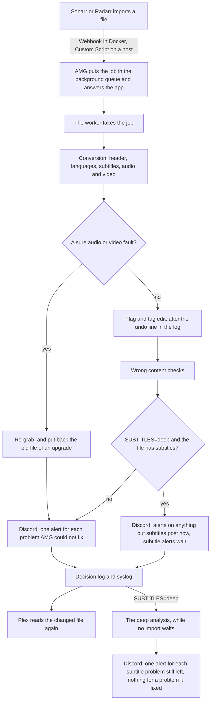

# How it works

This page follows one file from the moment Sonarr or Radarr imports it to the alert and the Plex update. It says, at
each step, what arr-media-guard (AMG) checks and what it may change. [features.md](features.md) describes each check,
and [design.md](design.md) the rules behind it. These words come up often.

- A *job* is one file that waits for its check. It is an import, a deep analysis or a recheck.
- The *listener* is AMG's small web server in Docker. The apps post to it through a **Webhook** connection. On a host,
  each app runs AMG as a **Custom Script** instead.
- The *worker* is the AMG process that takes the jobs and checks the files.
- The *state store* is a small database, `STATE_DIR/state.sqlite`. It holds the background queue and AMG's other
  records.
- The *background queue* is the line of jobs in the state store. Imports always go first, then the deep analyses, then
  the rechecks. A deep analysis or a recheck runs only while no import waits, one at a time.
- The *decision log* is the file `LOG` names. It gets a line for each file AMG checks.
- A *remux* writes a file again with the same video and audio. AMG never re-encodes.
- A *re-grab* deletes a broken file through the app and marks the grab as failed, so the app searches again.
- A *kept original* is the old file that a remux replaced. AMG keeps it for `KEEP_ORIGINALS_DAYS`.

## The path of one file

Each problem gets one Discord post. The import posts the problems it could not fix. With `SUBTITLES=deep`, the import
holds its subtitle alerts, because the deep analysis checks the subtitles again. The deep analysis posts only what it
still finds wrong. When it ends in an error or cannot judge the subtitles, the held alerts post then. With
`DISCORD_POSTS=all`, each change AMG made to the file posts too. See [6. What you see](#6-what-you-see) and
[7. The deep analysis](#7-the-deep-analysis).

## 1. The app tells AMG about the file

Sonarr and Radarr send an event at each import, upgrade, grab and Test. In Docker each app posts it to the listener, at
`/<instance name>`. On a host each app runs AMG with the event in its environment. Both ways lead to the same steps.

- **An import or an upgrade** becomes a job. Sonarr's **On Import Complete** event is refused, so use **On File Import**
  and **On File Upgrade**.
- **A grab** comes when the app picks a release. With `KEEP_REPLACED=true` and `KEEP_ORIGINALS_DAYS` above 0, AMG
  hard-links each file the grab may replace, so a bad upgrade can be undone later. See
  [regrabs.md](regrabs.md#keep-replaced-files).
- **A Test** runs the setup checks, see [The Test button and the start check](#the-test-button-and-the-start-check).
- Any other event gets an answer and changes nothing.

The listener checks the Webhook user and password, the size of the post and each id in it. It then asks the app for the
file's path by its id, because the app may rename the file after it posts. When the two paths differ, the decision log
gets a warning line, and the job takes the app's path. See [design.md](design.md#webhook).

## 2. The file waits in the background queue

AMG writes the job into the background queue in the state store, and answers the app at once. On a host it prints
`queued <path>` and starts a worker if none runs. The listener answers 200. The app waits for that answer. So when the
state store stays busy for 2 seconds, the job goes into the folder `STATE_DIR/queue` as a file. The worker moves it into
the background queue later.

In Docker, the listener puts an import in the background queue even when the app's API does not answer, or the file is
not yet in view. The worker then tries again, after a minute at first and at most an hour apart, for a day.

## 3. The worker picks up the file

One worker runs at a time. On a host the Custom Script starts it, so it runs inside the app's service, see
[design.md](design.md#memory). In Docker the listener starts it after it puts a job in the background queue, and every
60 seconds while a job waits. The worker exits when no job waits.

At its start the worker checks the state store. A broken store moves aside as `state.sqlite.corrupt-<time>`, and a new
one starts with the jobs it could read. Once a day the worker also removes kept originals older than
`KEEP_ORIGINALS_DAYS`. It puts back in the background queue the jobs a stopped worker left, and takes over the Plex
updates it saved. It then takes the jobs, oldest first. With `HOOK_WORKERS` above 1, it checks that many files at once.

The worker skips a job when an earlier re-grab of the same download deleted its file. When the file is not at its path,
it asks the app, and follows a file the app moved or renamed. It drops a job whose file is gone, and a job older than a
day. When the [policy file](policy.md) does not load, it skips the job, and one alert names the error. A job whose check
crashes three times is dropped with an error line.

## 4. AMG checks the file

The checks run in this order. A check can end the run early.

| Check | What AMG looks at | What it may change |
| --- | --- | --- |
| Conversion | A file in another container, such as AVI or MP4, with `CONVERT=true`. A `.mkv` file that holds another container always converts. | Writes the file into Matroska with the same streams, after it checks every stream of the new file packet by packet. See [features.md](features.md#conversion). |
| Header | The Matroska header, such as its length and its seek index. Junk data at the end, and subtitles that run past the end. | Repairs it in a remux, after a video check finds no real damage. `HEADER_REPAIR=false` turns it off. |
| Languages | The language and role of each audio and subtitle track. Language detection hears an audio track in doubt, and a word count reads subtitle text. | Plans the flag and tag edits. Nothing changes yet. |
| Subtitles | The words heard in two short parts of the audio, and more when needed, against each text subtitle in the audio's language. Lines that flash by too fast. Subtitles in other languages, timed against one that matched. | Plans one remux that takes out a subtitle of another episode, retimes a subtitle or makes its lines stay longer. Plans a sidecar move or rewrite. `SUBTITLES` sets how much it does. |
| Audio and video | Three samples of the audio that will play. Whether the video is cut short or filled with empty data, and three short parts of it decoded. | Nothing yet. A sure fault leads to a re-grab, a doubt to an alert. |

The import checks only what an import can afford. The checks that read the whole file wait for the deep analysis or a
command, see [7. The deep analysis](#7-the-deep-analysis).

## 5. AMG makes its changes

A sure audio or video fault replaces every other change with a re-grab. Otherwise the planned changes run.

- **Re-grab.** A second check from scratch must find the same fault. AMG then deletes the broken files of the whole
  download through the app, such as the broken episodes of a season pack. It marks the grab as failed. For an upgrade it
  puts back the old file from the recycle bin, or from its own hard link, if it checks clean. `REGRAB` picks the kinds
  of fault that re-grab, and `REGRAB_CAP` limits them to 30 a day for each app. See [regrabs.md](regrabs.md).
- **Flag edit.** First a line with the full undo command goes to the decision log. Then `mkvpropedit` changes the
  default and forced flags and the language tags in place. AMG reads the file again to check every flag. It never edits
  a file with another hard link, because the edit would also change the download client's copy. See
  [monitoring.md](monitoring.md#undo-an-edit).
- **Remux.** One remux makes every subtitle change, and a header repair is one too. The new file must pass a set of
  checks before it takes the old name. The old file stays as a kept original. A kept original is a hard link in
  `.<NAME>-originals`, at the top of the mount or in the highest folder AMG can write. Where links are refused, it is a
  copy. With `KEEP_ORIGINALS_DAYS=0`, nothing is kept, and AMG then removes no subtitle and changes no sidecar.
- **Sidecars.** A `.srt` file beside the video whose words do not match moves to the kept originals. One whose times are
  off, or whose lines flash, is written again with new times. Only its time lines change.
- **Wrong content.** After the edit, AMG checks the audio language, the runtime, and the year and title in the release
  name against TMDB and the app. Two points of evidence mark the content as wrong. It re-grabs only when `REGRAB` lists
  `content`. These checks have their own time limit, and they do not run when a re-grab already took the file.

After a remux or a conversion, AMG asks the app to scan the item again, so the app sees the new file.

## 6. What you see

- **Decision log.** One summary line per file in `LOG`, with the tracks, the plan, the reasons, the outcome and each
  problem found. An edit, a remux or a move adds a line of its own. See [monitoring.md](monitoring.md#the-decision-log).
- **Syslog.** A one-line summary of the same, tagged with `NAME`. In Docker it also goes to the container log. It names
  the job, as the listener's `queued` line does. See [monitoring.md](monitoring.md#syslog).
- **Discord.** One alert for each problem the job left unresolved, to `DISCORD_WEBHOOK`. A problem AMG fixed, such as a
  re-grab or a removed subtitle, goes to the decision log only. The same alert posts once for the same file. With
  `DISCORD_POSTS=all`, each change AMG made to the file posts too. With `SUBTITLES=deep`, the subtitle alerts wait for
  the deep analysis, see [7. The deep analysis](#7-the-deep-analysis). See [features.md](features.md#alerts).
- **Plex.** After a change, AMG asks Plex to read the item again, so Plex shows the new tracks. A new import is often
  not in Plex yet, so AMG looks for it for 10 minutes. The item's library must be idle on two checks 15 seconds apart,
  because a read during a Plex scan can crash Plex. After 30 minutes of a busy library, AMG leaves it to Plex's own
  scan. With `PLEX_URL` empty, nothing goes to Plex. See [design.md](design.md#plex).
- **status.json.** `STATE_DIR/status.json` says whether the policy file loaded and whether the TMDB key works, for a
  monitoring tool. See [monitoring.md](monitoring.md#status-file).

## 7. The deep analysis

With `SUBTITLES=deep`, an import of a Matroska file with subtitles, or with a `.srt` beside it, puts a second job in the
background queue. This *deep analysis* is the slower subtitle check of `--sub-time`. It reads the whole file and listens
to much more of the audio. It can move a stretch of lines that is out of sync, and time live captions line by line. It
can also retime foreign subtitles by the speech, and repair garbled text. See [features.md](features.md#subtitle-match).

It runs only while no import waits, and it stops between two steps when one arrives. It keeps the flags the import set,
and it alerts only on subtitles. When the app renamed or moved the file, it checks the file at its new path. It drops
itself when the app replaced or removed the file. A deep analysis that a
stopped container left runs after the next start.

The import posts no subtitle alert when a deep analysis follows. It keeps those alerts in the deep analysis job. The
deep analysis checks the subtitles again and posts once, only what it still finds wrong. So a problem it fixes gets no
alert. The kept alerts post when the deep analysis cannot judge the subtitles again. That happens after an error, a
failed hearing, or with `SUBTITLES` set to `off` by then. They wait in the state store, so a restart keeps them. The
decision line of the deep analysis names the import's job in `from`, so you can match the two lines.

A *recheck* is another kind of job in the background queue. After an update, AMG queues one for each file whose saved
subtitle check the new version can improve. It repeats that check on the file, and never checks deeper. It waits behind
the imports and the deep analyses, and acts as the deep analysis does. `SUBTITLES` decides whether it fixes or only
alerts. See [Recheck after an update](features.md#recheck-after-an-update).

## The Test button and the start check

Press Test in the app's connection, or save it, and the app sends a Test. AMG then checks that the env file reads, that
the policy file loaded, and that the app's API answers with its key. It also checks that it sees each root folder of the
app. On a host it checks the Instance Name too, see [Several instances](#several-instances). A failed check fails the
Test and names what to fix. It also warns when the app's recycle bin is off or out of reach, and when `KEEP_REPLACED`
would keep nothing.

In Docker, the listener runs a start check when it starts, and answers the apps meanwhile. It reads the
[path maps](docker.md#path-maps) and runs the Test checks for each app with an API key. It turns on On Grab where
`KEEP_REPLACED` needs it. It then checks Plex, Discord, TMDB, SABnzbd and the indexer where the setup uses them. It asks
an app or a service that does not answer again, for 2 minutes in all. A failed check prints a warning, and the listener
keeps running. `--selftest` runs the same checks on the command line. It fails on a setting it cannot read, an env file
that is there and cannot be read, or a policy file that does not load. It only warns about the apps and services.

## The nightly audit

| Job | What it does | On a host | In Docker |
| --- | --- | --- | --- |
| Audit | `--audit <instance> --since 24h --post` reviews the day's edits, from the plan AMG saved after each edit. It posts a list when one of the day's files has a problem. It writes one syslog line every night. | A systemd timer or cron, one line per instance. | The listener at `AUDIT_TIME`, for each instance whose API key reads. |
| Clean up | Removes kept originals and grab links older than `KEEP_ORIGINALS_DAYS`. Turns on On Grab where `KEEP_REPLACED` needs it. | The audit, and the worker once a day. | The same. |
| Log rotation | Rotates the decision log weekly, with compression. | logrotate. | The listener, after the audits. |
| Recheck after an update | Queues a recheck of each file whose saved subtitle check the new version can improve, once per version. | The first audit of the version. The rechecks run after the next import starts the worker. | The listener, after the start check. |

When the container was down at `AUDIT_TIME`, the audit runs when it starts again that day. An empty `AUDIT_TIME` turns
the audit and the rotation off. An old `last_hook_run` in `status.json` shows that the audit or the imports stopped. See
[commands.md](commands.md#the-audit).

## Commands over your library

The worker checks only new imports. Commands run the same checks over the files you already have. A backfill is dry
unless you add `--apply`, and no command posts a change to Discord or re-grabs.

- `--backfill <instance>` fixes the default tracks and language tags of the Matroska files the app lists. It skips a
  file with one audio track and no subtitle, which plays that track anyway. It runs at the lowest CPU and disk priority.
- `--backfill <instance> --convert` converts the files that are not `.mkv`. `--sub-check` adds the subtitle check, and
  `--sub-time PATH` runs the full subtitle check of the deep analysis on single files. `--sub-check` skips a file whose
  saved result still holds, and `--recheck` checks it anyway.
- `--check-audio` and `--check-video` scan every file much as an import checks it, and only read. A scan resumes over
  days, lists what it finds in `STATE_DIR`, and posts one summary when it finds a problem.

Run a large backfill as a dry run first, check the plans, then try a small sample with `--canary N`, then the rest. See
[commands.md](commands.md#dry-runs-and-the-backfill).

## Several instances

One install serves any number of Sonarr and Radarr instances, such as a second Sonarr for 4K. `APP_INSTANCES` adds them.
The decision log, the syslog line and the alerts name the instance, and each instance has its own `REGRAB_CAP`. In
Docker the URL path of the Webhook picks the instance. On a host the app's Instance Name picks it. When two apps of one
program share an Instance Name, the Test fails. The worker then refuses the imports of that program until the names
differ. See [the README](../README.md#several-sonarr-or-radarr-instances).

## Locks and time limits

The worker, a backfill and a scan can reach one file at the same time. A file lock keeps them apart. Reads share the
lock, and an edit, a re-grab or a remux takes it alone. An edit that waits goes before new readers, so a long scan never
keeps it out. An import waits an hour at most for the lock.

An import has 300 seconds from the lock to `mkvpropedit`. Most programs it runs and calls to an app end at that limit.
`mkvpropedit` and a remux have no time limit. A stop of the container waits for `mkvpropedit`, the swap of a converted
file and a re-grab. So none of them is left half done. The wrong-content checks after the edit get 300 seconds of their
own. See [design.md](design.md#how-it-runs).

## Settings that only report

An import always applies its changes. Some settings make parts of it report only.

- `SUBTITLES=check` reads the subtitles and alerts, and changes no subtitle.
- `HEADER_REPAIR=false` leaves a wrong header as it is.
- A kind of fault that `REGRAB` leaves out still gets its second check. The alert title then ends "re-grab is off", and
  nothing is deleted.

The backfill, `--sub-check` and `--sub-time` are dry unless you add `--apply`. A dry run reads and decides as an apply
would, and changes no file. Its decision line and its printed line say what `--apply` would do. See
[commands.md](commands.md#dry-runs-and-the-backfill).
