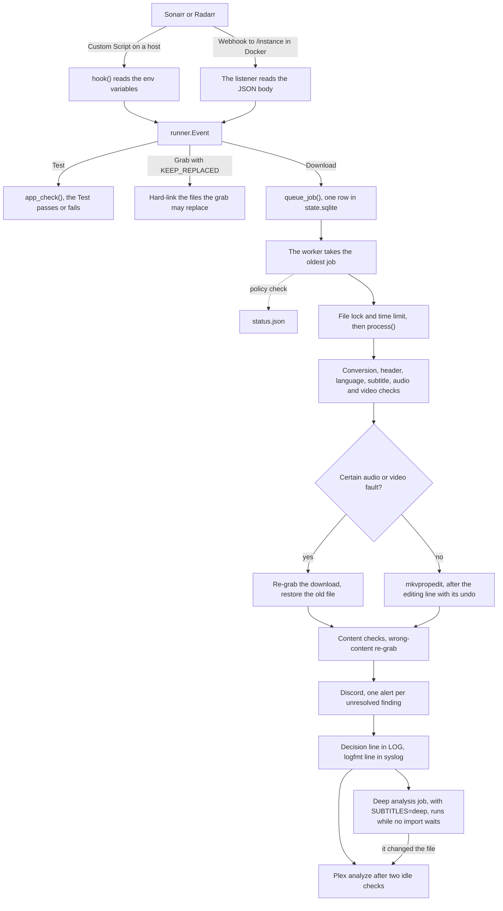

# How it works

This page follows one imported file from Sonarr or Radarr to the alert and the Plex analyze. It is for someone new to
the project. Each section says what happens and why, and links to the detail in [design.md](design.md) or another doc.
These terms come up often.

- A *job* is one imported file that waits in the queue.
- The *hook* is the run of the Custom Script on a host. The *listener* is the HTTP server in Docker that takes the
  Webhook posts of the apps.
- The *worker* is the process that takes the jobs and checks the files.
- The *state store* is the SQLite file `STATE_DIR/state.sqlite`. It holds the job queue and the other state, see
  [The state store](#the-state-store).
- The *decision log* is the file that `LOG` names. Its *decision line* is the JSON line for one file.
- To *hear* a track is to let the optional speech model name its spoken language.
- A *finding* is one problem that a check found in the file.
- A *certain fault* proves that a file is broken and leads to a re-grab. A *doubt* only alerts.
- A *re-grab* deletes a broken file through the app and marks the grab failed, so the app searches again.
- A *Plex analyze* asks Plex to read the file again, so Plex shows the new flags.

## The import path

## 1. An event arrives

Sonarr and Radarr send an event at each import, upgrade, Grab and Test. On a host, each app runs the script as a
**Custom Script** connection, and `hook()` in `runner.py` reads the event from environment variables. In Docker, each
app posts a **Webhook** to the listener in `serve.py`, at `/<instance name>`, see [Named instances](#named-instances).
The Webhook sends the event as a JSON body. Both build the same `runner.Event` record from the event, so the rest of
the path is one code path.

- **Download** is an import or an upgrade. It becomes a job.
- **Grab** comes when the app picks a release. With `KEEP_REPLACED=true`, the hook or the listener hard-links each file
  the grab may replace. A bad upgrade can then be undone from these *grab links*. See
  [regrabs.md](regrabs.md#keep-replaced-files).
- **Test** runs the setup checks, see [The Test event and the start check](#the-test-event-and-the-start-check).
- Any other event gets an answer and changes nothing.

The listener checks the Webhook user and password, the body size and each id in the body. The body also names the
file's path (`movieFile.path` or `episodeFile.path`). The listener takes the path from the app's API by the file id
instead, because the worker edits that file in place. A body can name any path, and the app may rename the file after
it sends the body. When the two paths differ, the decision log gets a warning line, and the job takes the API's path.
See [design.md](design.md#webhook).

## 2. The job is queued

`queue_job()` writes the job as one row in the queue of the state store. The hook then prints `queued <path>`, starts a
worker if none runs, and exits 0. The listener answers 200. The app waits for this answer. So when the state store does
not take the job within 2 seconds, the job goes into `STATE_DIR/queue/` as a file. The worker moves it into the state
store later.

In Docker, the listener queues an import even when the app's API fails. The worker then asks the API again, after a
minute at first and at most an hour apart, for a day. See [design.md](design.md#webhook).

## 3. The worker takes the jobs

One worker runs at a time, because it holds the lock file `STATE_DIR/worker.lock`. On a host the hook forks the worker,
so it runs in the app's cgroup, see [design.md](design.md#memory). In Docker the listener starts
`arr-media-guard --serve --worker` after it queues a job, and every 60 seconds while a job waits.

At its start the worker checks the state store. A broken state store moves aside as `state.sqlite.corrupt-<time>`. A
new one starts with the jobs the worker can read from the old one. The worker then removes the temporary folders that a
killed remux or conversion left in `STATE_DIR`. Once a day it removes the kept originals and grab links older than
`KEEP_ORIGINALS_DAYS`, see [The nightly job](#the-nightly-job). It puts the jobs that a dead worker left back in the
queue. It also takes over the Plex analyzes that a stopped worker saved. It then runs the import jobs, oldest first,
and exits when the queue is empty and no Plex analyze waits. With `HOOK_WORKERS` above 1, it forks one process per job.
A job process that crashes writes a decision line with the error, and three crashes drop its job. See
[design.md](design.md#how-it-runs).

A re-grab deletes every broken file of its download. So the worker skips a job whose file an earlier re-grab of the same
download deleted. When the file is not at its path, the worker asks the app for the file by its id. It takes the new
path when the app moved or renamed the file. It drops the job when the app no longer lists that file for the item. It
also drops a job older than a day. When the [policy file](policy.md) does not load, the worker skips the job, and one
alert names the error.

## 4. The checks

`process()` in `process.py` runs the steps of one file in this order. A step can end the run early.

| Step | What it does | Detail |
| --- | --- | --- |
| Conversion | A file that is not Matroska becomes `<base>.mkv` with `CONVERT=true`. A `.mkv` file that holds another container always converts. | [design.md](design.md#conversion) |
| Header | Reads the Matroska header and the Cues, the seek index of the file. A wrong header, such as a wrong duration, gets a lossless remux, after a video check finds no damage. | [design.md](design.md#header-repair) |
| Language | Classifies every track and plans the flags. The speech model hears an audio track whose language is in doubt. A count of common words names the language of a text subtitle. | [design.md](design.md#language-tags) |
| Subtitles | Hears two short windows of the audio. It compares the heard words with each text subtitle and `.srt` file in the language of a main audio track. It also checks the timing, and finds the cues that show too briefly to read. `SUBTITLES` sets what it does. | [subtitles.md](subtitles.md) |
| Audio and video | Samples the audio track that will play, then reads the video. | [design.md](design.md#broken-audio) |
| Content | Checks the language, runtime, year and episode title against the app and TMDB. | [design.md](design.md#metadata-checks) |

The content checks run after the flag edit of [6. The actions](#6-the-actions), with a time limit of their own. A
failure or a timeout there ends only the content checks, because the edit is already done.

## 5. The decision

The rules in `decide.py` read the policy file. They give each audio and subtitle track a language, a confidence and a
role, such as main, commentary or forced. Then they pick the audio that plays first, and the subtitles to match. The
result is the *plan*, the list of flag and tag edits. When the tags, titles and flags of the tracks conflict, the plan
stays empty, and the outcome in the decision line is `undecided`. The rules drop a plan that would break an invariant,
a rule that every result must keep, such as one default audio track. See [design.md](design.md#what-it-changes) and
[policy.md](policy.md).

## 6. The actions

A certain audio or video fault replaces the flag edit with a re-grab. Else the planned edits run.

- **Flag edit.** `mkvpropedit` sets the default and forced flags and the language tags in place. First an `editing`
  line with the full undo command goes to the decision log. Then mkvmerge reads the file again, and the worker checks
  every flag. The worker never edits a hardlinked file, because the edit would also change the download client's copy.
  See [monitoring.md](monitoring.md#undo-an-edit).
- **Header repair.** mkvmerge writes the file again with no new encode. The new file must pass a set of checks, such as
  the same tracks and clean decoded windows, before it takes the old name. The original stays as a kept original. See
  [design.md](design.md#header-repair).
- **Subtitle remux.** One remux makes every subtitle change. It removes a subtitle whose words do not match the audio.
  It retimes a subtitle whose times are off, and lengthens the cues that show too briefly. It keeps the original too. When the remux cannot run, a subtitle that
  does not match loses its flags instead. See [design.md](design.md#subtitle-match).
- **Conversion.** A proof compares the packets of every stream in the new file with the original. The original goes
  only after the app lists the new file. A conversion that shows a damaged source re-grabs. See
  [design.md](design.md#conversion).
- **Re-grab.** A second check from scratch must find the same certain fault. The worker then deletes the broken files
  of the whole download through the app, such as the broken episodes of a season pack. It sets their movie or episodes
  to monitored again and marks the grab failed, so the app searches again. The old file of a broken upgrade comes back
  from the recycle bin, or from its grab link, before the app searches. `REGRAB_CAP` limits the re-grabs of each
  instance in 24 hours. See [regrabs.md](regrabs.md).
- **Wrong content.** The content checks add up points, and two points make a re-grab. This re-grab runs only when
  `REGRAB` lists `content`. Else the alert title ends "re-grab is off". See [design.md](design.md#metadata-checks).
- **Sidecars.** A sidecar is a `.srt` file beside the video. A sidecar whose words do not match the audio moves to the
  kept originals. One whose times are off, or whose cues show too briefly, is written again with new times. See
  [subtitles.md](subtitles.md).
- **Kept originals.** A repair keeps the file it replaced for `KEEP_ORIGINALS_DAYS`, as a hard link in
  `.<NAME>-originals` on the file's mount. The nightly audit and the worker remove it after that time, see
  [The nightly job](#the-nightly-job) and [regrabs.md](regrabs.md#kept-originals).

After a remux or a conversion, the worker asks the app to rescan the item.

## 7. The outputs

The alerts go out at the end of `process()`. The worker then writes the decision line. The Plex analyze waits in the
worker until Plex is ready, see **Plex** below.

- **Decision log.** One JSON line per file in `LOG`, with the tracks, the plan, the reason codes, the outcome and each
  finding. The worker also writes the fields that the nightly audit reads into the state store. See
  [monitoring.md](monitoring.md#the-decision-log).
- **Syslog.** One logfmt summary of the same line, tagged with `NAME`. In Docker it also goes to the container log. See
  [monitoring.md](monitoring.md#syslog).
- **Discord.** One embed per finding that the job left unresolved, to `DISCORD_WEBHOOK`. A problem the job fixed, such
  as a re-grab or a removed subtitle, goes to the decision log only. A marker in the state store stops a repeat alert
  for the same file, alert kind and file size. See [design.md](design.md#alerts).
- **Plex.** After a change, the worker sends the Plex analyze of the one item. A new import is often not in Plex yet,
  so the worker looks for it again for 10 minutes. Before each analyze, the item's library section must be idle on two
  checks 15 seconds apart. An analyze during a scan can crash Plex. A file that a conversion renamed gets a scan of its
  folder instead. With `PLEX_URL` empty, nothing goes to Plex. See [design.md](design.md#plex).
- **status.json.** `STATE_DIR/status.json` holds the state of the policy file and the TMDB key, for a monitoring agent.
  Each job records whether the policy file loaded. Each live TMDB answer records whether the key works. See
  [design.md](design.md#status-file).

With `SUBTITLES=deep`, the job then queues a deep analysis of a file with subtitles. That is a separate job with a
slower subtitle check, see [subtitles.md](subtitles.md#levels) and [design.md](design.md#how-it-runs).

## The Test event and the start check

Press Test in the app's connection, or Save it, and the app sends a Test event. `runner.app_check()` then checks that
the policy loaded and that the app's API answers with its key. It also checks that arr-media-guard sees each root folder
of the app. On a host it checks the Instance Name too, see [Named instances](#named-instances). A failed check fails the
Test and names what to fix. On a host the script answers `arr-media-guard: Test ok` or exits 1. The listener answers 200
or 500. When `KEEP_REPLACED` keeps no grab links, the Test warns about an app recycle bin that is off or out of reach.
Without a bin, the restore after a bad upgrade needs `KEEP_REPLACED`.

In Docker, the listener runs a start check when it starts, and it answers the apps meanwhile. The check reads the
[path maps](docker.md#path-maps), then runs the Test checks for each app with an API key. It asks an app that does not
answer again for 2 minutes. A failed check prints a warning, and the listener keeps running. See
[docker.md](docker.md#the-listener).

`--selftest` runs the same checks from the command line. It fails on a setting it cannot read or a policy file that
does not load. It only warns about the apps.

## The nightly job

The nightly job audits the day's edits, prunes the kept originals and grab links, and rotates the decision log.

| Job | What it does | On a host | In Docker |
| --- | --- | --- | --- |
| Audit | `--audit <instance> --since 24h --post` reviews the day's edits from the state store. It reads the plan that the worker made right after each edit. When that plan is missing, it probes the file again. It posts a list of the day's files when one of them has a problem. It writes one syslog line every night, and it records the policy status. | A systemd timer or cron, one line per instance. | The listener at `AUDIT_TIME`, for each instance whose API key reads. |
| Prune | Removes the kept originals and the grab links older than `KEEP_ORIGINALS_DAYS`. | The audit, and the worker once a day. | The same. |
| Log rotation | Rotates the decision log weekly, with compression. | logrotate. | The listener, after the audits. |

In Docker the listener starts `arr-media-guard --serve --daily` once a day, which runs the audits and then logrotate.
When the container was down at `AUDIT_TIME`, they run when it starts again that day. An empty `AUDIT_TIME` turns both
off. A `status.json` whose `last_hook_run` is older than 2 days shows that the audit or the script stopped. See
[commands.md](commands.md#the-audit), [design.md](design.md#audit) and
[monitoring.md](monitoring.md#rotate-the-decision-log).

## Backfill and scans

The worker checks only new imports. Commands run the same code over the library, dry unless `--apply` is given.

- `--backfill <instance>` runs the decision over the files the app lists, and with `--apply` it edits the flags. It
  runs at nice 19 and idle I/O priority. It never posts to Discord and never re-grabs.
- `--backfill <instance> --convert` adds the conversion, and `--sub-check` adds the subtitle check. `--sub-time PATH`
  runs the full subtitle check on single files.
- `--check-audio` and `--check-video` scan every file the way the worker checks an import. A scan only reads. It
  keeps its place in the state store, so it resumes over days. It lists what it finds in
  `STATE_DIR/<kind>-scan-<instance>.txt`, or `<kind>-scan-<instance>-ids.txt` for a run with `--ids`. A run that
  finds a problem posts one summary.

Run a large backfill as a dry run, an audit of the plans, a canary (a small sample, `--canary N`) and then the rest. See
[commands.md](commands.md#dry-runs-and-the-backfill) and [design.md](design.md#backfill).

## The state store

All state lives in one SQLite file, `STATE_DIR/state.sqlite`, in WAL mode. It holds the job queue, the re-grab counts
and the records of the kept originals and grab links. It also holds the pending Plex analyzes, the alert markers, the
TMDB cache, the scan progress and the facts that the audit reads. Each change runs in one short transaction. The
decision log, `status.json`, `lid.sqlite` (the cache of the speech model) and the locks stay files of their own. So do
the text lists that a person reads, such as the scan lists. See [design.md](design.md#state).

In Docker the state store sits in the named volume `amg-state`, because SQLite in WAL mode needs a local disk. See
[docker.md](docker.md#mounts).

## Named instances

One install serves any number of Sonarr and Radarr instances. `sonarr` and `radarr` are the default instances, and
`APP_INSTANCES` adds more, such as `sonarr-4k`. The decision log, the syslog line, the alerts and the state records
name the instance. Each instance has its own re-grab cap.

In Docker the URL path picks the instance. On a host every instance runs the same script, and the app's Instance Name
picks the instance. When two apps of one program share an Instance Name, a hook run can reach the wrong instance. The
Test then fails, and the worker refuses the imports of that program until the names differ. See
[the README](../README.md#several-sonarr-or-radarr-instances) and [design.md](design.md#instances).

## Locks and the time limit

The worker, a backfill and a scan can reach one file at the same time. The file lock `STATE_DIR/lock` keeps them apart.

- A read takes the lock shared, so a scan and the job processes of `HOOK_WORKERS` read side by side. With
  `HOOK_WORKERS` at 1, an import job takes the lock exclusive from the start.
- An edit, a re-grab, a header repair and a subtitle remux take the lock exclusive.
- A conversion builds its new file under the shared lock. Only its swap, the step that puts the new file in place of
  the original, takes the lock exclusive.
- A second lock file, `lock.gate`, lets a waiting edit go before new readers, so a long scan never keeps an edit out.
- `worker.lock` lets one worker run at a time. An import job waits an hour at most for the file lock.

An import job has 300 seconds from the file lock to `mkvpropedit`. Each subprocess, HTTP call and lock wait ends at
that limit. `mkvpropedit`, a remux and its swap have no limit, because a kill mid-write can break the file. SIGTERM
waits for `mkvpropedit`, a conversion's swap and a re-grab. The content checks after the edit get 300 seconds of their
own. See [design.md](design.md#how-it-runs).

## Dry run and apply

An import always applies. Some settings make parts of it report only.

- `SUBTITLES=check` reads the subtitles and alerts, and changes no subtitle.
- `HEADER_REPAIR=false` reports a wrong header and leaves the file as it is.
- A fault kind that `REGRAB` leaves out still gets its second check. The alert title then ends "re-grab is off", and
  nothing is deleted.

A command is dry unless `--apply` is given. A dry run reads and decides as an apply would, and changes no file. Its
decision line and its printed line say what `--apply` would do. So a dry run and an audit of its plans show the effect
before any edit. See [design.md](design.md#alerts) and [commands.md](commands.md#dry-runs-and-the-backfill).
